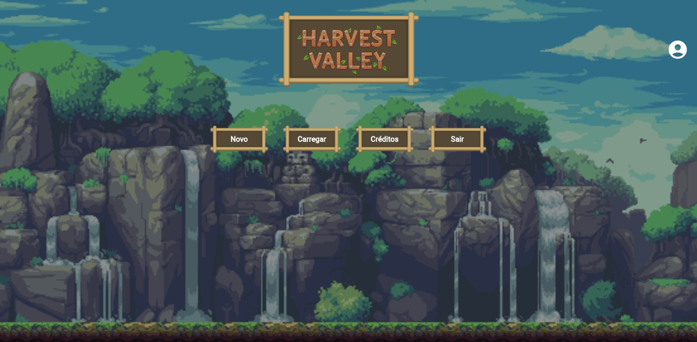
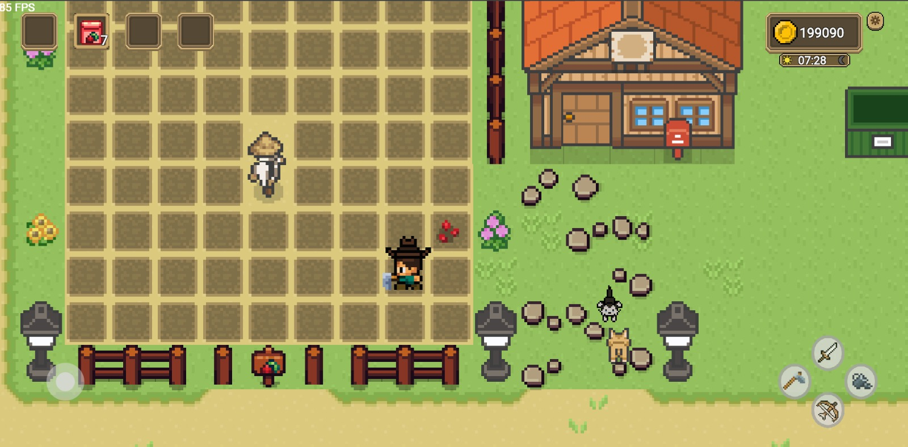
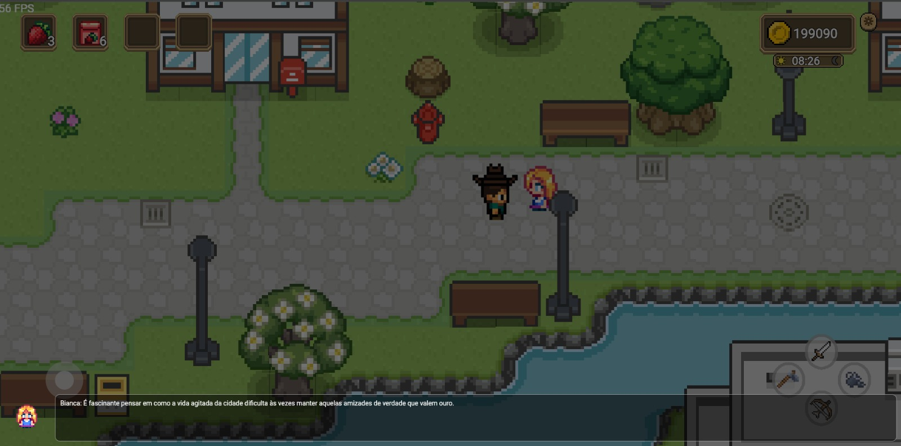

# Harvest Valley

Harvest Valley é um jogo de simulação de fazenda em pixel art com foco em sustentabilidade e interação comunitária. O jogador deve gerenciar sua fazenda, cultivar lavouras e ajudar na limpeza da cidade para aumentar sua reputação, tudo isso enquanto interage com NPCs que utilizam Inteligência Artificial para diálogos e missões dinâmicas.

------------------------------------------------------------------------

## Alunos integrantes da equipe

-   Gabriel Costa Vianna
-   Pedro Henrique Félix Dos Santos
-   Arthur Costa Serra Negra
-   Gabriel Diniz Reis Vianna
-   Matheus Silva Coxir

------------------------------------------------------------------------

## Professores responsáveis

-  Cristiano Neves Rodrigues

------------------------------------------------------------------------

## Descrição Geral do Projeto

O **Harvest Valley** é um RPG de simulação desenvolvido em Flutter utilizando a engine Bonfire. O jogo coloca o jogador no papel de um novo morador do vale, herdando a responsabilidade de revitalizar uma fazenda e auxiliar a comunidade local.

A mecânica principal gira em torno do ciclo de plantio, colheita e venda de produtos, somada a um sistema de **sustentabilidade**: o jogador ganha reputação ao limpar o lixo da cidade e reciclar materiais. O jogo conta com um ciclo de dia e noite, sistema de inventário e economia, além de NPCs inteligentes.

Destaques tecnológicos incluem a sincronização de dados entre local e nuvem e a integração com **IA Generativa (Gemini)**, que cria missões e diálogos únicos baseados no contexto atual do jogador, tornando cada gameplay exclusiva.

------------------------------------------------------------------------

## Funcionalidades Principais

-   **Sistema de Farm:** Preparar o solo, plantar sementes (morango, batata, etc.), regar e colher lavouras.
-   **Sustentabilidade e Reputação:** Coleta de lixo e limpeza da cidade que impactam diretamente a reputação do jogador com os NPCs (ex: Prefeito).
-   **Inteligência Artificial (Gemini API):**
    -   Geração de missões dinâmicas baseadas na reputação, itens e histórico do jogador.
    -   Diálogos imersivos e não repetitivos dos NPCs baseados no contexto do jogo.
-   **Sistema de Save Híbrido:** Salvamento de progresso local e sincronização na nuvem com login.
-   **Movimentação de NPCs:** Algoritmo de pathfinding para movimentação autônoma dos personagens.
-   **Ciclo Dia/Noite:** Impacta as atividades e a necessidade de descanso do personagem.
-   **Loja e Economia:** Compra de sementes e venda de produtos no armazém.

------------------------------------------------------------------------

## Estrutura do Repositório

    Codigo/
      harvest_valley/
        lib/
          app/          # Configurações globais e inicialização
          audio/        # Controladores de som e música
          auth/         # Lógica de autenticação e login (Firebase)
          conversa/     # Sistema de diálogos e integração com IA (Gemini)
          data/         # Persistência de dados (Hive e modelos locais)
          npc/          # Comportamentos e lógica dos personagens
          pages/        # Telas da interface (Menu, Login, Jogo)
          player/       # Controles e atributos do jogador principal
          services/     # Serviços externos e APIs
          main.dart     # Ponto de entrada da aplicação
          AnimalManager.dart  # Lógica de gerenciamento dos animais
          FarmManager.dart    # Lógica do sistema de plantio
          ...                 # Outros componentes (Tiles, Sprites, Itens)
    Documentacao/
    README.md

A estrutura do projeto separa a lógica de jogo (Managers e NPCs) da interface de usuário (Pages) e dos serviços de backend (Auth e Services), facilitando a manutenção e escalabilidade.

------------------------------------------------------------------------

## Tecnologias utilizadas

-   **Flutter:** Framework principal de desenvolvimento.
-   **Bonfire Engine:** Engine de jogos para RPG/Top-down em Flutter (baseada em Flame).
-   **Flame:** Motor de jogo base.
-   **Hive:** Banco de dados NoSQL leve para persistência de dados local (progresso do jogo).
-   **Firebase:** Utilizado para autenticação (Login) e sincronização do salvamento na nuvem.
-   **Shared Preferences:** Gerenciamento de configurações simples (ex: volume de áudio).
-   **Google Gemini API:** IA utilizada para gerar missões e diálogos contextuais.
-   **Algoritmo A\* (A-Star):** Implementado com heurística de distância Manhattan para o pathfinding dos NPCs.

------------------------------------------------------------------------

## Instruções de utilização

### Clonar o repositório

    git clone https://github.com/ICEI-PUC-Minas-CC-TI/plmg-cc-ti4-2025-2-g03-harvestvalley

### Acessar a pasta do projeto

    cd Codigo/harvest_valley

### Instalar dependências

    flutter pub get

### Configuração de API (Opcional)

Para o funcionamento pleno da IA, crie um arquivo `.env` na raiz com sua chave da API Gemini:
`GEMINI_API_KEY=sua_chave_aqui`

### Executar o aplicativo

    flutter run

------------------------------------------------------------------------

## Capturas de Tela

### Menu e Login

### Gameplay na Fazenda

### Interação com NPCs e Cidade

------------------------------------------------------------------------

## Contribuição de cada integrante

-   Gabriel Costa: Scrum Master e desenvolvimento
-   Gabriel Diniz: UI e desenvolvimento
-   Arthur Costa: Desenvolvimento
-   Pedro Félix: Desenvolvimento e IA
-   Matheus Coxir: Desenvolvimento, Grafos e UX

------------------------------------------------------------------------

## Limitações e melhorias futuras

-   **Limitações:** O sistema de pathfinding pode apresentar lentidão em mapas muito grandes com muitos obstáculos. A IA depende de conexão com a internet para gerar novos diálogos.
-   **Melhorias Futuras:**
    -   Implementação de sistema de pesca.
    -   Expansão do mapa para novas áreas exploráveis.
    -   Modo multiplayer cooperativo.
    -   Melhoria na variedade de sementes e animais para criação.

------------------------------------------------------------------------

## Referências

-   Documentação do Flutter: https://flutter.dev/docs
-   Bonfire Engine: https://bonfire-engine.github.io/
-   Documentação do Hive: https://docs.hivedb.dev/
-   Google AI for Developers (Gemini): https://ai.google.dev/
